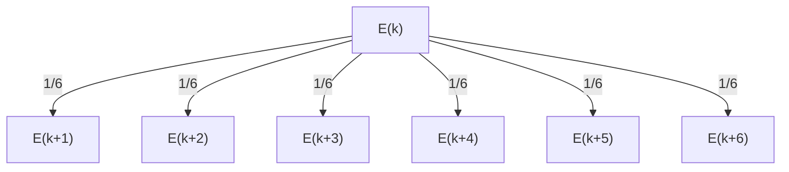
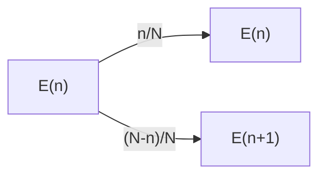
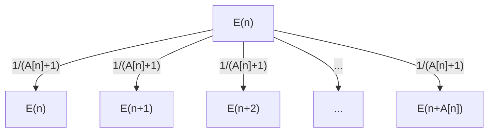

# 確率 DP / 期待値 DP

すごくいいかんじの pdf があるのでこれをベースに勉強した。

- [確率 DP を極めよう - 確率と期待値の問題解説](https://compro.tsutaj.com//archive/180220_probability_dp.pdf)


## 確率 DP

> $1$ から $6$ までの整数が等確率に出るサイコロがある。このサイコロを $N$ 回振るとき、出た目の数の和が $K$ 以上になる確率を求めよ。

```python
# dp[n][k]: サイコロを n 回振って和が k になる確率

for n in range(N):
    for k in range(K):
        for i in range(1, 6+1):
            dp[n+1][k+i] += dp[n][k] * (1/6)
```


### 期待値 DP

> $1$ から $6$ までの整数が等確率に出るサイコロがある。出た目の数の和が $K$ 以上になるまでこのサイコロを振るとき、サイコロを振る回数の期待値を求めよ。




以下の式が成り立つので、これをメモ化再帰で実装する。

$$E_{k} = \frac{1}{6} ( E_{k+1} + E_{k+2} + E_{k+3} + E_{k+4} + E_{k+5} + E_{k+6} ) + 1$$

```python

# dp[k]: 現在の和が k のとき和を K 以上にするために必要な回数の期待値
dp = [-1.0] * (K+6)
for k in range(K, K+6):
    dp[k] = 0.0

def E(k: int) -> float:
    if k >= K:
        return 0.0
    if dp[k] == -1.0:
        dp[k] = (E(k+1) + E(k+2) + E(k+3) + E(k+4) + E(k+5) + E(k+6)) * (1/6) + 1
    return dp[k]
```

ともかく図を描くことができれば、あとは立式するのみ。

遷移の前後で状態が変わらないような選択肢がある場合、式変形が必要になる。

- [ABC194D - Journey](https://atcoder.jp/contests/abc194/tasks/abc194_d)



$$ E_n = \frac{n}{N} E_n + \frac{N-n}{N} E_{n+1} + 1 $$

$E_n$ について解くと $E_n = E_{n+1} + \frac{N}{N-n}$ となる。

$E_n$ を求めるときの計算量が $O(N)$ になってしまうとき (毎回総和をとるなど) はセグメントツリーや累積和を使うことも考えておく。

- [ABC263E - Sugoroku 3](https://atcoder.jp/contests/abc263/tasks/abc263_e)



$$E_n = \frac{1}{A[n]+1} \left(E_n + E_{n+1} + \cdots + E_{n+A[n]}\right) + 1$$

これを整理すると

$$E_n = \frac{1}{A[n]} \left( E_{n+1} + E_{n+2} + \cdots + E_{n+A[n]} + A[n] + 1 \right) $$

ここで、$E_{n+1} + E_{n+2} + \cdots + E_{n+A[n]}$ の部分を毎回計算していると間に合わないが、メモ化再帰ではなく $E_N$ から降順に計算できるので、$E$ 全体をセグメントツリーなどで管理して総和を高速に求めることができる。