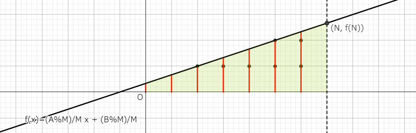

# Floor Sum

- [AtCoder Library Practice Contest C - Floor Sum](https://atcoder.jp/contests/practice2/tasks/practice2_c)

$$\sum_{i=0}^{N-1} \left\lfloor {\frac{Ai+B}{M}} \right\rfloor$$ を $O(\log A + \log M)$ で求める。

下図の格子点を再帰的に数えることを考える。すなわち、$\sum_{i=0}^{N-1} \lfloor (Ai+B)/M \rfloor$ を、より領域の小さい $\sum_{i=0}^{N'-1} \lfloor (A'i+B')/M' \rfloor$ に置き換えていく。


はじめに、長方形の部分と直角三角形の部分を数える。このとき、直角三角形の斜辺の傾きはとりうる最大の整数とする。それぞれの領域で実線部分は境界を含む。


このとき、各部分の格子点の個数は、

- 長方形の部分: $\left\lfloor {\frac{B}{M}} \right\rfloor \times N$
- 直角三角形の部分: $\left\lfloor {\frac{A}{M}} \right\rfloor \times N(N-1)/2 $

となる。残る領域を変形すると下図となる。(直角三角形の斜辺から $y=(Ax+B)/M$ まで $y$ 軸平行に線分を引くと、変形の前後で線分の長さは等しいので、格子点の個数は変わらないことがわかる)



ここで、直線 $f(x)$ の式は $f(x)=\frac{A\%M}{M}x + \frac{B\%M}{M}$ となる[^floor]。この領域を $(N,0)$ に対して点対称に動かす。


動かした直線を $g(x)$ とする。傾きは $M/(A\%M)$ である。このあと領域全体を $x$ 軸負方向に $N - \lfloor f(N) \rfloor$ だけずらす。


まず、傾きから、$A' = M, M' = A\%M$ である。
ずらしたあとの幅を $N'$ とすると、$N' = N - (N-\lfloor f(N) \rfloor) = \lfloor f(N) \rfloor$ である[^clear]。
また、$y=(A'x+B')/M'$ が $(N'- f(N), 0)$ を通るので、代入して頑張って計算すると $B'=((A\%M)N+B\%M)\%M$ であることがわかる。

$N,M,A,B$ の更新は $O(1)$ で、ユークリッドの互除法と同様に $A$ と $M$ で余りを取り合いながら計算するので、ループ回数は $O(\log A + \log M)$ である。

```python
def floor_sum(n, m, a, b):
    res = 0
    while n > 0:
        res += (a//m)*(n*(n-1)//2) + n*(b//m)
        n, b = divmod(a % m * n + b % m, m)
        m, a = a % m, m
    return res
```

[^floor]: $0$ より大きい整数 $a$, $b$ について $a/b - \lfloor a/b \rfloor = a\%b/b$ が成り立つ。
[^clear]: ここがごちゃごちゃしないように、初めから反転させて考える方法もある。[@kyopro_friends さんの解説](https://twitter.com/kyopro_friends/status/1304063876019793921)
